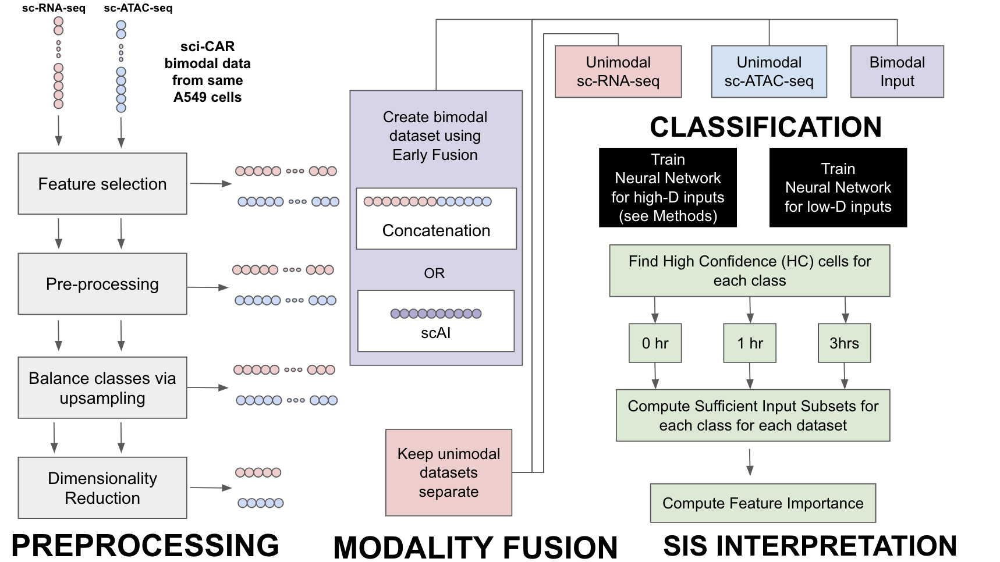
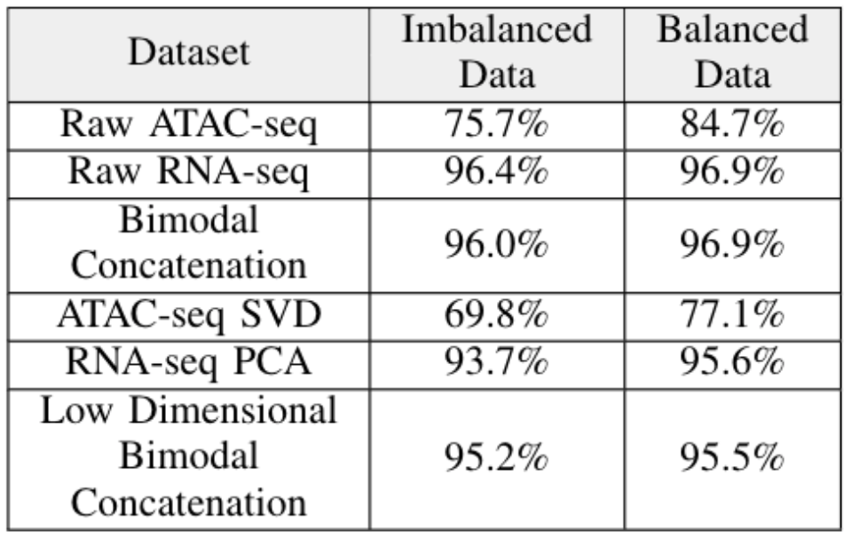
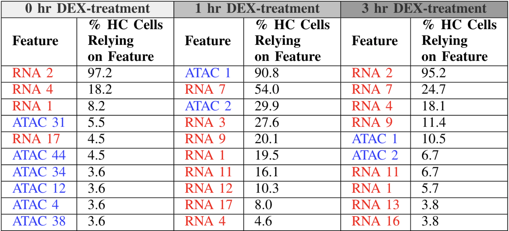
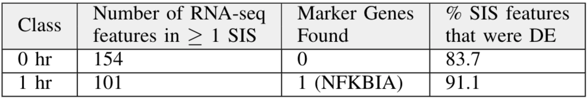

### Computational Pipeline:

### Overview
In this work, we show how multimodal single-cell data can be combined to improve cell-state classification in a deep learning framework. We focus on classifying lung adenocarcinoma-derived A549 cells that have been treated with dexamethasone (DEX), a synthetic compound similar to cortisol, for varying amounts of time. This dataset contains gene expression (sc-RNA-seq) and chromatin accessibility (sc-ATAC-seq) data from the same 4,825 cells. We show that both modalities together improve classification of cells by DEX-treatment time. We show how a variety of preprocessing and early-fusion modality integration methods change classification performance; regardless of the preprocessing method applied, bimodal inputs do not outperform unimodal inputs on cell-state identification, instead they tended to perform on-par with sc-RNA-seq unimodal inputs. 

Additionally, we aimed to know how informative each modality is in classification. While both modalities play roles in improving classification, features from sc-RNA-seq are more informative than features from sc-ATAC-seq in cell-state classification. We show the first use of Sufficient Input Subsets (SIS)identifying sc genomic features -- unimodal and bimodal -- that lead to classification of cells classified with high confidence.  We investigate how SIS might be useful in determining which modality is the most informative. Lastly, we use SIS on sc-RNA-seq data to understand whether SIS can be used for identifying marker genes and differentially-expressed genes, validating our findings using the original paper that developed sci-CAR.

### Motivation
Leveraging multiple single-cell modalities may allow for better classification of cells by their cell type or cell state. Understanding how to classify cells is crucial to large-scale consortiums like the [Human Cell Atlas](https://www.humancellatlas.org/), [HUBMAP](https://commonfund.nih.gov/hubmap), and the [Cell Census Network](https://braininitiative.nih.gov/brain-programs/cell-census-network-biccn), among others.  Much work is still required, however, in using multi-modal techniques for improving classification.

### Summary of Results

#### Early Fusion Bimodal inputs outperform scAI Multimodal Integration but perform similarly to RNA-seq inputs

This study explored the value of creating multimodal representations of single-cell omics data in a neural net classification task. The table above shows the accuracy of each classifier on the different datasets. One method of multimodal integration we evaluated was Early Fusion Bimodal, which involved the concatenation of the unimodal data. We find that Bimodal concatenation fails to consistently outperform the RNA-seq data. The classifiers run on the Early Fusion Bimodal datasets only slightly outperform the RNA-seq data for the non-feature-selected datasets and the low-dimensional representation of the data. In all other cases the RNA-seq dataset outperforms the Bimodal concatenation dataset. This seems to imply that the majority of the informative content is present in the mRNA expression and that there is only slightly more information provided by the inclusion of the ATAC-seq data into the Bimodal representation. These results indicate that RNA-seq may be informative enough to use for cell-type identification unimodally rather than leveraging bimodal representations. 

This work also compared the relatively simple Early Fusion Bimodal representations with the novel, complex scAI multimodal integration method designed for integrating single cell RNA-seq and ATAC-seq data. However, on the Class-Balanced datasets for both the Raw Data and the Low-Dimensional Data, the classifier accuracy for the Bimodal Datasets, 96.5% for the Bimodal Raw Data concatenation and 95.5% for the Bimodal Low-Dimensional concatenation, far outperforms that of the scAI Integration output, 55.6%. Despite the complex learning methods employed by scAI in order to integrate multiple single cell-omics modalities and represent them lower dimensionally, the outputs seem ill-suited for cell-type classification via neural nets. Instead a computationally simpler method such as Early Fusion may be more optimal for neural net applications. 

#### RNA-seq is more informative than ATAC-seq in cell-type identification

We aimed to know which of the two modalities was more informative for classifying cells by cell state (i.e. amt of time treated with DEX). We found all Sufficient Input Subsets of features for each cell classified with high confidence (P(class | data) >= 0.7). Given these disjoint subsets, we computed the percent of high-confident (HC) cells  that relied on each feature for each of the three classes (0 hr, 1 hr, & 3 hrs). The table below ranks these features and colors the feature name by the modality it came from. It's evident that features from RNA-seq are most needed to classify HC cells treated with DEX for 0 hrs and 3 hrs. Features generated from the ATAC-seq modality were most necessary to classify HC cells treated for 1 hr, yet most subsets also relied on features from RNA-seq as well. Together, this implies that features from both RNA-seq and ATAC-seq are necessary for classifying by cell state, yet RNA-seq is largely more informative than ATAC-seq for this classification task. 

#### SIS may be a useful alternative method to finding marker or DE genes

Using the SIS method to understand which features most contribute to cell-state classification naturally raised the question of whether SIS could find marker genes and differentially-expressed genes. We found the sufficient input subsets after training our neural network on sc-RNA-seq features only, following feature selection (1185 features in total). Similarly to the previous section, we found the percent of high-confidence cells that rely on each of the features found in at least one subset.  We then compared the expressed genes found using SIS with those found in the original paper that introduced the sci-CAR method. SIS found one gene (NFKBIA) that was named a marker gene in DEX-treated cells. A vast majority of the genes found in SIS were also classified as differentially-expressed genes. 

The table below summarizes these results for HC cells classified as treated for 0 hr and 1 hr. No subsets were found for HC cells classified as 3 hr, preventing us from finding any additional marker genes beyond NFKBIA. 

