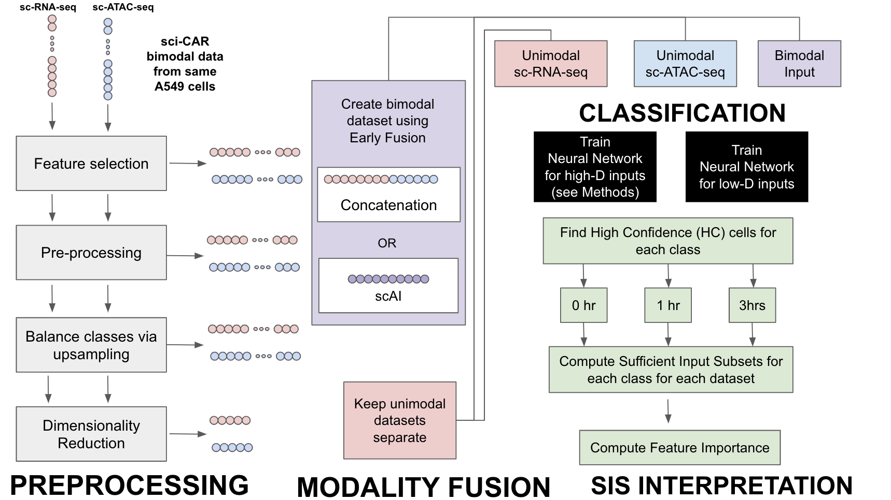

## Methods
The diagram of the project pipeline is described in above, consisting of data pre-processing, preparing the bimodal inputs using early fusion, classification using neural networks, and feature interpretation using sufficient input subsets. The next sections describe this pipeline in more detail. 

### Dataset
This work analyzed the output of a multimodal single-cell omics technique presented by Cao et al. named [sci-CAR](http://cole-trapnell-lab.github.io/pdfs/papers/cao-sci-car.pdf), a single-cell combinatorial indexing method (sci) which jointly profiles chromatin accessiblity and mRNA (CAR) . This method allows for the performance of single-cell mRNA sequencing and single-cell Assay for Transposase-Acessible Chromatin (ATAC) sequencing to be performed on individual cells in a high-throughput manner. In brief, the cell nuclei are extracted and loaded into wells where well-specific barcodes are introduced into the RNA sequence via reverse transcription and amplification primers. The ATAC sequences are also associated with well-specific barcodes via in-situ tagmentation with Tn5 transposase and amplification primers. As nuclei pass through a unique combination of wells, they are imbued with a unique combination of barcodes. These are then used to link mRNA sequences and ATAC sequences to individual cells and thus each other. Cao et al. applied this method to human lung adenocarcinoma-derived A549 cells, cultures of which were applied to 0, 1 or 3 hours of 100nM desamethasone. This resulted in an overall dataset of 4825 cells that produced both transcriptome and chromatin accessibility data for the AD549 cells. 

### Data Preparation

#### Data Preprocessing and Feature Selection
Quality control was performed on the A549 dataset in order to ensure the suitability of the RNA-seq and ATAC-seq for further analysis, as in the [scAI study performed by Jin et al](https://genomebiology.biomedcentral.com/articles/10.1186/s13059-020-1932-8). For the RNA-seq data, genes that were expressed in fewer than 10 cells were removed from the dataset. Additionally the cells that had cell expression counts less than 500 or more than 9100 were also removed from the dataset. For the ATAC-seq data, loci that were present in fewer than 5 cells were removed and cells with fewer than 200 accessible loci were removed from the dataset. 

The dataset was also exposed to feature selection methods to determine the most informative genes and loci, as in the Jin et al. study. The Wilcoxon rank-sum test was performed to compare candidate genes in different cell groups. Candidate genes were considered informative if the p values were less than 0.05 and log fold-changes were higher than 0.25. After these quality control and feature selection processes were performed only the cells that were still present in both the RNA-seq and ATAC-seq datasets were retained. This resulted in the an RNA-seq dataset with 2641 cells and 1185 genes and an ATAC-seq dataset with 2641 cells and 52,761 loci. These preprocessed datasets were accessed from a github repository created by Jin et al. 

#### Data Upsampling
After the pre-processing and feature selection steps were completed, the dataset showed a significant amount of class imbalance between the different time durations of dexamethasone treatment, 583 cells for 0 hours, 983 cells for 1 hour, 1075 cells for 3 hours. In order to address this class imbalance, upsampling was used to increase the sample number of minority classes. The decision was made to pursue upsampling over downsampling since neural network architectures benefit from training on larger datasets. Minority classes were randomly sampled to create repeated samples until they matched the sample number of the majority class. This was implemented using the [groupdata2 package in R](https://CRAN.R-project.org/package=groupdata2). This resulted in the raw RNA-seq and ATAC-seq datasets with balanced cell sample counts of 1075 across the 0, 1 and 3 hour classes with a total cell count of 3225 for each dataset. 

### subsection{Multimodal Integration}

#### subsubsection{Raw Data Early Fusion Representation}
A joint representation of the two raw RNA-seq and ATAC-seq datasets were created for downstream analysis. This followed the methodology of early fusion which involved the concatenation of the ATAC-seq dataset to the RNA-seq dataset along the feature axis, resulting in a Bimodal concatenation dataset composed of 3225 cells and 53,946 features for the upsampled case and 2641 cells and 53,946 features for the base case. 

#### subsubsection{Dimensionality Reduction and Low Dimension Early Fusion Representation}
Lower dimensional representations of the Raw Data datasets were created for early fusion as well as downstream analysis. The methods used in the Jin et al. study were followed to perform dimensionality reduction on each dataset. For the RNA-seq data, this study used the [Seurat](http://satijalab.org/seurat/) toolkit to perform dimensionality reduction, which involved performing Principal Component Analysis (PCA) to extract 30 principal components of the dataset. This work replicated this dimensionality reduction using the *scikitlearn.decomposition.PCA* library in Python. This resulted in a lower dimensional RCA-seq dataset of 3225 cells and 30 principal component features. This study used the [*Signac* toolkit](https://satijalab.org/signac/)in order to perform dimensionality reduction on the ATAC-seq dataset, due to the sparsity and almost binary nature of the data, this was performed via Singular Value Decomposition (SVD) where the dataset was reduced to 50 components. This work replicated this dimensionality reduction with the *scikitlearn.decomposition.TruncatedSVD* library in Python.  This resulted in a lower dimensional ATAC-seq dataset of 3225 cells and 50 SVD components. 

Early Fusion was also applied to these lower dimensional datasets for downstream analysis. Again this involved a simple concatenation of the low-dimensional datasets along the feature axis, resulting in a Bimodal SVD-PCA dataset of 3225 cells and 80 features. 

#### Multimodality Integration via scAI
This work also explored novel methods of multimodal integration designed to integrate single cell omics modalities, namely single-cell aggregation and integration. scAI is a method that integrates the transcriptomic profiles generated via mRNA-seq as well as the chromatin accessibility profiles derived by ATAC-seq. This process adopts a learning method that computes a unified matrix factorization model incorporating both transcriptomic and aggregated epigenomic data in order to learn a cell-cell similarity matrix. This allows the process to aggregate the epigenomic data into subgroups that are similar in terms of epigenomics and gene expression. This allows for the representation of cell populations in a lower dimensional space in terms of their gene and loci expressions. This work made the use of the scAI toolkit applied to the RNA-seq and ATAC-seq analysis of the A549 cell dataset in order to develop a lower dimension representation of the cells in terms of 2 and 20 learned factors for downstream analysis. 

### Dataset Summary
All of the above analyses resulted in the following datasets available for downstream analysis in the neural net cell-type identification task, see the table below for details.

### Classification

#### Neural Network Architecture and Optimization
We employed two similar architectures for classifying by cell-type -- one for classifying high-dimensional data after applying various pre-processing methods (see above) and one for classifying low-dimensional data.  Each architecture consisted of three fully-connected layer, three drop-out layers, and an output layer with three activation units. 

ReLu activation was used following each fully-connected layer and softmax activation was used after the output layer to compute probabilities for each class.  L2 regularization was used to improve generalization and mini-batch Gradient Descent was used as an Optimizer. 

#### Training and Testing
Testing sets were made for each unimodal and bimodal input by holding out 10% from the original dataset. Hyper-parameter search was done using grid-search on the training set over 10 epochs per combination of hyper-parameters for high-dimensional datasets and 25 epochs for low-dimensional datasets. After grid-search and hyper-parameter selection, each model was trained over 100 epochs using a batch size of 64.  

### Sufficient Input Subsets
[Sufficient Input Subsets](https://arxiv.org/abs/1810.03805) is an interpretability method for understanding why a black-box model reaches a particular decision for examples *x* in **X**. 

We used an [SIS tutorial in classifying MNIST digits] (https://github.com/google-research/google-research/blob/master/sufficient_input_subsets/tutorials/sis_mnist_tutorial.ipynb) as a reference for finding high-confidence (HC) cells that were classified with probability >=  0.7 and for finding SIS-collections of features needed to classify each HC cell. 

After finding all HC cells assigned to each class for each dataset, we aggregated all features that were found in at least 1 SIS for any HC cell.  We then found the percentage of the HC cells that contain a SIS with each feature to compute feature importance scores.  For example, if there are 100 HC cells classified as DEX-treated for 1hr and the sc-RNA-seq gene SLC35F3 appears in an SIS for 75 of these, then the feature importance for SLC35F3 would be 75% for classifying cells as 1hr.  

We validated the features we found with the original paper that developed sci-CAR. We compared our features with the markers for the glucocorticoid receptor which is activated upon treatment with dexamethasone, a synthetic mimic of cortisol. That paper mentions the following as markers: NFKBIA, SCNN1A, CKB, PER1 and CDH16. We then compared our features with the differentially-expressed genes found in the sci-CAR paper. Genes were considered significantly expressed if they met a p-value  of < 0.05 using the Bonferroni correction. We then found the percent of features from the SIS-collection on the sc-RNA-seq dataset (after feature selection and class-balancing)  that were considered as differentially expressed. 

